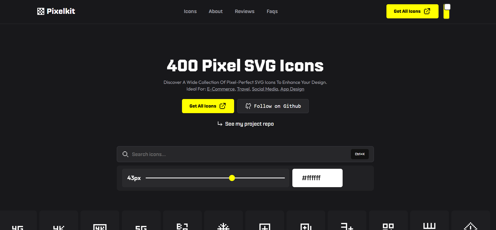

# <a href="https://pixelkit.vercel.app" target="_blank">PixelKit Icons - Pixel-perfect SVG Icons</a>

PixelKit Icons is a lightweight, client-first SVG icon browser and toolbox. Browse an icon index on a CDN, inline icons into the page, and quickly search, resize, recolor, and copy pixel-perfect SVG markup — all in the browser with no uploads. Ideal for developers and designers who want fast access to SVG assets, easy styling via `currentColor`, and a small, accessible UI.

<p align="left">
  <a href="./LICENSE">
    
  </a>
  
  
  <a href="https://github.com/byllzz">
    
  </a>
  <a href="https://github.com/byllzz/pixelkit-icons/releases">
    
  </a>
</p>

<br>

[](https://pixelkit.vercel.app)



⭐ Star the repo on GitHub — it helps!

---

## What is PixelKit?

PixelKit is a small, dependency-light web app that:
- Loads an SVG index from a CDN (jsDelivr) and inlines icons into a responsive grid.
- Lets you **search** icons by name, **resize** them, **recolor** them via a color picker, and **copy** SVG markup to the clipboard.
- Persists user preferences (theme, color, size, search) locally using `localStorage`.
- Includes graceful fallbacks (small bundled list) if the CDN index cannot be fetched.
- Focuses on accessibility, keyboard support, and fast UI updates (batch loading).

---

## Features

- ✔️ Fast, client-first icon browser
- ✔️ Search and client-side filtering (persisted)
- ✔️ Live recolor using CSS `currentColor` + color picker
- ✔️ Size slider that updates `--icon-size` (inline SVG sizing)
- ✔️ Per-icon **Copy SVG** button (Clipboard API + textarea fallback)
- ✔️ “Download All” opens CDN index for bulk access
- ✔️ Batch loading for progressive rendering and smooth UX
- ✔️ LocalStorage persistence for theme, color, size, search
- ✔️ Small offline fallback icon set when CDN is unreachable
- ✔️ Accessible controls and keyboard-friendly interactions
- ✔️ Debug surface: `window._pixelIcons` for runtime inspection

---


## Installation

Clone the repository and open locally, or host static files (Netlify / Vercel / GitHub Pages):

```bash
# clone
git clone https://github.com/byllzz/pixelkit-icons.git
cd pixelkit-icons

# open index.html in your browser (or use Live Server)
# e.g. in VSCode use Live Server extension, or host with a static server:
# npx serve .   or   npx http-server .

```
# License 📄

This project is licensed under the MIT License - see the [LICENSE.md](./LICENSE) file for details.

Please contact me at bilalmlkdev@gmail.com if you have any feedback or suggestions. :star: Star it, if you like it!
